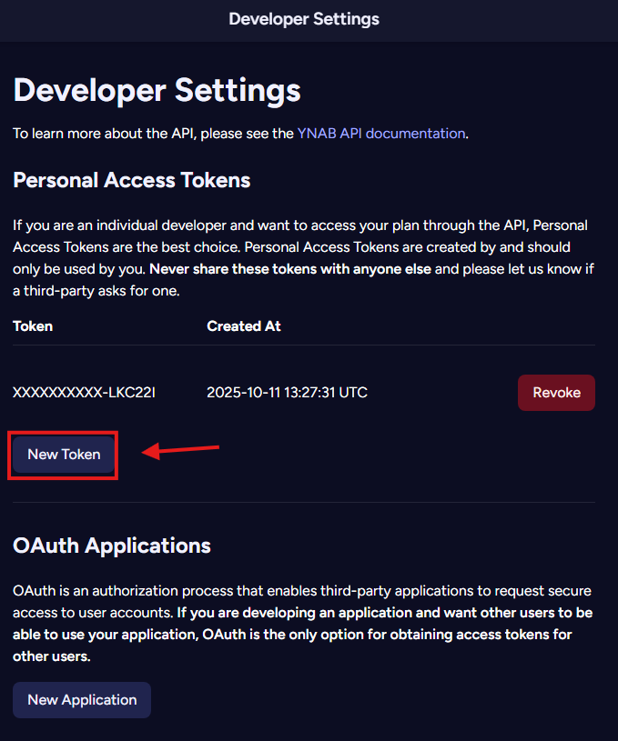
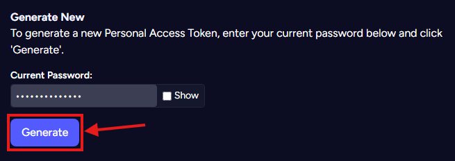
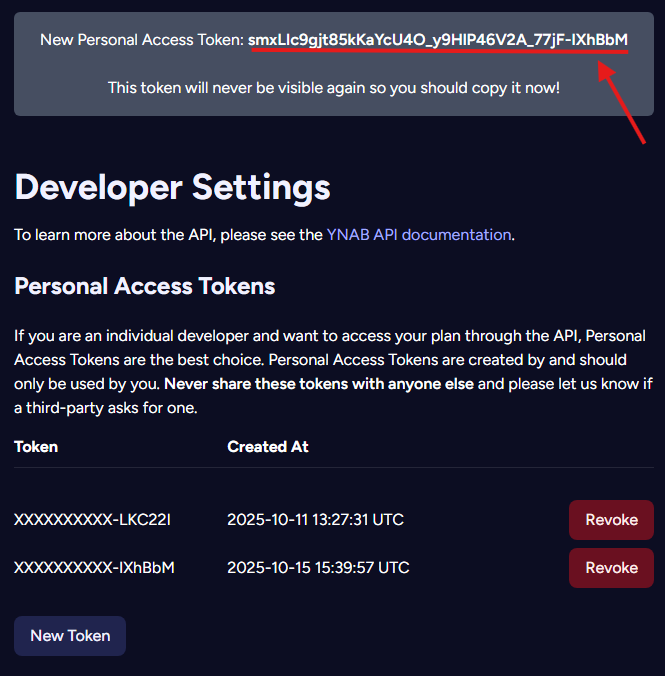

# Create YNAB Access Token
Let's create a YNAB Personal Access Token to allow `ynab-connect` to access your budget.

Go to the [developer settings](https://app.ynab.com/settings/developer).

## Press "New Token"

## Enter your password and press "Generate"

## Copy your token

